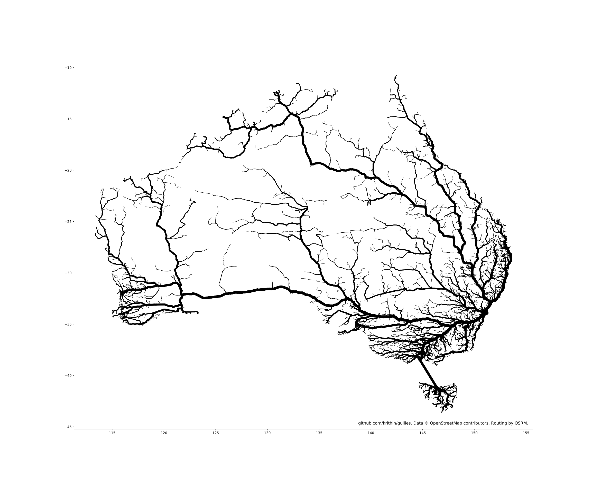

## Gullies
Maps of routes draining into a common sink from all over a road network.

Prints of these images are available on my society6 page: https://society6.com/krithin


Inspired by moovel labs' [Roads to Rome](https://lab.moovel.com/projects/roads-to-rome) and Topi Tjukanov's [Roads of America](https://tjukanov.org/roadsofamerica/).

## Usage

### Prerequisites
In general, you'll need an [OSM](https://en.wikipedia.org/wiki/OpenStreetMap) snapshot to process, an [OSRM](http://project-osrm.org/) instance running against that same snapshot, and some intial set of destination points to route to (such as from one of the files in [inputdata/](inputdata/) or as generated by [getlocations.py](getlocations.py)).

In more detail:
1. Grab an OSM extract for a region you're interested in. These are available from http://download.geofabrik.de/ or other sources listed on the [OSM wiki](https://wiki.openstreetmap.org/wiki/Planet.osm#Planet.osm_mirrors).
    ```
    curl -O http://download.geofabrik.de/north-america/us/new-york-latest.osm.pbf
    ```

2. Get OSRM. If you want to build from source, you can do so following the instructions at https://github.com/Project-OSRM/osrm-backend/wiki/Building-OSRM:
    ```
    git clone https://github.com/Project-OSRM/osrm-backend.git
    mkdir osrm-backend/build
    cd osrm-backend/build
    cmake ..
    cmake --build .
    ```
    Note: You can also use the [osrm-backend docker image](https://github.com/Project-OSRM/osrm-backend/wiki/Docker-Recipes) instead of building from source if you wish.

3. Preprocess the OSM snapshot you downloaded earlier so OSRM can route against it:
    ```
    cd osrm-backend
    build/osrm-extract -p profiles/car.lua ~/new-york-latest.osm.pbf
    build/osrm-partition ~/new-york-latest.osrm
    build/osrm-customize ~/new-york-latest.osrm
    ```
    Warning: This step might take a lot of memory. `osrm-extract` for a map of the whole of the US peaked at 46 GiB of RAM used.

4. Start the OSRM server:
    ```
    build/osrm-routed --algorithm mld ~/new-york-latest.osrm
    ```

5. You'll also need to install the following Python packages, using either `pip` or your favourite package manager:
* [matplotlib](https://matplotlib.org/users/installing.html)
* [requests](https://github.com/requests/requests)
* [osmium](https://github.com/osmcode/pyosmium)

### Generating images
Get started by cloning this repo:
```
git clone https://github.com/krithin/gullies.git
cd gullies
```

1. Generate a set of destination points to route to:
    ```
    python getlocations.py ~/new-york-latest.osm.pbf 10000 > nylocations.csv
    ```
    As an alternative to using getlocations.py to generate the locations, you can instead use one of the census datasets included in [inputdata/](inputdata/).

2. Generate routes to those points:
    ```
    cat nylocations.csv | python getroutes.py http://localhost:5000 > nyroutes.txt
    ```

3. Collate the resulting routes:
    ```
    cat nyroutes.txt | python collatesegments.py ~/new-york-latest.osm.pbf > nyroutescollated.txt
    ```

4. Simplify the collated routes:
    ```
    cat nyroutescollated.txt | python simplifysegments.py 4 > nyroutessimplified.txt
    ```

5. And produce a plot:
    ```
    cat nyroutessimplified.txt | python plotmatplotlib.py new-york.png
    ```
    If you run this last step on a server machine without X or some other graphical interface installed, you might encounter a known Matplotlib issue for which the solution is to [explicitly specify a plotting backend](https://stackoverflow.com/questions/4931376/generating-matplotlib-graphs-without-a-running-x-server#4935945)

## Gallery
Australia from Sydney


Roads from all over New York state, draining into New York City:


Singapore


Roads from all over the contiguous United States, draining into the mouth of the Mississippi at New Orleans:

